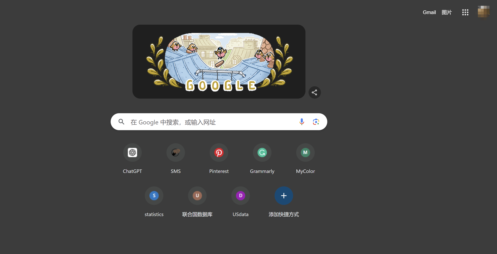

# 学会科学上网     CS 0.0.0

>  前言😊：学会科学上网是所有计算机科学专业同学的必备技能，海量资料需要通过无穷无尽的外网来查询；本教程主要是教会大家如何科学上网。
>
> 📢Prerequisite：1.一颗完整的电脑      2.带上你的脑子

## 一、如何正确的科学上网

> 谈到科学上网，部分同学可能只知道“科学上网”只是为了访问我们访问不到的外部世界，实际上，作为一名优秀的计算机练习生，我我们必须弄清楚什么是科学上网。

### I. 什么是科学上网—代理

因为一些众所周知的原因，我们使用国内的宽带服务和通讯，访问不了一些特定的外国网站，比如著名的搜索引擎[谷歌](https://google.com)。在这种情况下，我们需要一个神通广大的“中间人”——**代理（proxy）**。只要把我们想访问的网站信息告诉他，他就会帮我们访问，并把获取的信息原封不动（或者有所改动）地传回给我们。这个中间人就叫代理（是不是很像代购商呢？）。只要我们在网络上启用这个代理，就能轻松访问那些我们平常无法访问的网站。

!!! warning "注意你的隐私安全"
    实际上，代理可以完全看到你的**访问信息**，同时也可以修改返回给你的信息，为了隐私安全性，要特别注意选取合适的代理提供商。一些打着“免费”旗号的代理，可能正在窃取你的隐私信息。

一般来说，这种代理的提供商有很多，有些是需要**收费**的，而有些则是**免费**的。有些代理很强大，在很多国家都架设了服务器。比如你使用了一个在美国的节点，那么就相当于你找了一个代购商在美国，它可以帮你访问在美国能访问到的网站。

### II.如何在你的计算机上使用代理

光有了代购商还不行，代购商必须要把东西送到你手上呀。在这一个过程中，代理软件就起到了作用，代理软件的作用就是在你的电脑上开启代理服务，把你的网络请求发送给代理而不是直接发给目标网址，代理再帮你访问，访问的数据返回给你。就像代购商一样，帮你完成了代购服务，但是最后东西还是到你手上。

一般来说，最流行的代理软件是Clash，这是一个开源的、免费的软件，目前已经在 `Github` 上跑路了，庆幸的是，我这里还有一份备份，是Windows X86 版本的，随附。

#### Clash教程

解压我提供的`Clash.rar`，会得到一个`Clash`文件夹，点击进入文件夹，打开名为 `Clash for Windows.exe` 的可执行程序，会出现Clash界面，如下图所示：

!!! tip "安装提示"
    整个安装过程中，Windows可能会弹出各种各样的安全提醒界面，记得全部点**【同意】、【是】**	

在 `常规` 界面中，我们需要点亮 `允许局域网连接` 、`IP6协议地址`、  `服务模式`右边的🌏图标，以及系统代理

在 `配置` 界面中，我们需要下载订阅链接，下一步会详细说明。

完成以上步骤，我们已经完成了Clash软件的配置，是不是十分简单😁

#### 购买代理提供商

实际上，有很多代理提供商，这里选择一个我常用的，网络稳定性比较好但是**略贵**的代理商freeking，教程如下：

1. 在浏览器中打开[FreeKing](https://www.freeking.app/)，选择右上角的登录，没有账号就按步骤注册一个。
2. 登录成功后，点击最左边的侧边栏中的 `购买订阅`，然后选择套餐`免费体验`
3. 点击后，在新跳转的界面点击  `下单` ，按步骤完成后点击侧边栏中的`仪表盘`，返回主界面
4. 下拉界面，在 `捷径` 中点击 `一键订阅`，选择`导入到 Clash for Windows`
5. 回到你的Clash软件，查看配置中是否新增了 `Freeking`开头的配置名，单击选中该配置(左边竖条变为绿色)

到这里你已经成功地购买了代理提供商，如果你还想有更好的体验，可以选择**付费**购买该代理商提供的套餐。

#### 最后一步，开启科学上网

到这里只剩最后一步啦，你就可以开启科学上网了，步骤如下

1. 打开你的 Clash 软件，点击左侧侧边栏的 `代理`，进入 `代理` 界面后点击上面的 `全局`，切换到 `全局` 界面
2. 单击选择一个延迟较小的国家节点（韩国、日本、新加坡等都可），如果都显示超时，可以点击右侧的Wi-Fi图标进行刷新。如果多次刷新仍显示超时，请检查你的网络。
3. 点击左侧侧边栏中的 `常规` ，进入 `常规` 界面，开启 `系统代理` 
4. 检查是否成功，请在浏览器中输入 `Google.com`，如果能够访问，说明你的科学上网成功
5. 如果不需要科学上网了，可以关闭系统代理或者Clash软件

#### 注意事项

关闭电脑前需要先把Clash的系统代理或者软件关闭，如果直接关闭电脑，那么下次开机的时候可能出现连不上网的问题，这个时候需要重新打开Clash或者在系统设置里关闭**系统代理**。

> 关闭系统代理的步骤（Windows 11系统）
>
> 1. 右键左下角的 Windows图标 （四个蓝方块，说的就是你），在弹出的菜单栏里选择【设置】
> 2. 在【设置】窗口中找到【网络与Internet】选项，点击进入
> 3. 在【网络与Internet】窗口中找到 【代理】选项，单击进入
> 4. 在【代理】窗口中找到 【使用代理服务器】选项，单击 【编辑】 进入
> 5. 在【编辑】 窗口中找到 【使用代理服务器】，把关掉即可

!!! note "为什么需要这个步骤（原因）？"
    如果在关闭电脑前没有关闭Clash的系统代理或软件，那么系统仍然会认为你在使用代理，但负责代理的软件实际上已经关闭了。这就像你去找一个已经关门的代购买东西，不仅代购的东西买不到，连正常的东西也买不到。网络代理也是一样，当你试图通过已关闭的代理服务器访问互联网时，就相当于试图访问一个已经关闭的服务器，结果自然是网络中断。因此，你需要关闭代理服务器，直接使用你的网络来访问正常的网址。

    Clash软件则自动化了这一过程，每次打开和关闭时，都会自动管理系统的代理服务器，确保网络连接的正常使用。

## 二、程序员必备的科学网站

!!! note "科学网站的重要性"
    作为一名程序员，在学会了如何进行科学上网后，就要知道有哪些【科学】网站，这些网站往往比国内的网站资源更丰富、功能更强大（最重要的是可能没有烦人的广告😇）

!!! danger "务必遵守法律法规"
    网络不是法外之地，在使用科学网站时，要自觉遵守相关法律法规，不浏览具有**政治**问题的网站，不发表**政治**性评论，不加入具有争议性的群聊和议题，自觉做到爱国、守法。

### 谷歌浏览器 Chrome

我不仅仅推荐你用谷歌进行学术相关的搜索，更鼓励你使用谷歌浏览器Chrome。以下几个点也许能够成为推荐谷歌浏览器Chrome的原因：

- **速度与性能**：Chrome浏览器以其快速的页面加载速度和流畅的性能著称。它使用了高效的V8 JavaScript引擎，并且对HTML5和CSS3等新技术支持良好，能够更快速地渲染网页。
- **用户界面和体验**：Chrome**没有讨厌的广告**，界面十分简洁干爽。
- **开发者工具**：Chrome提供了强大的开发者工具（**DevTools**），方便前端开发者进行调试、性能分析、查看DOM结构和网络请求等。

!!! info "Edge—另一优秀的浏览器"
    除了Google旗下的Chrome，Microsoft旗下的Edge浏览器也是一款优秀的浏览器。同样没有广告、纯净的Edge为我们提供了新的人工智能助手——Bing。类似于ChatGPT，Bing可以支持实时问答，检索需要的资料等功能。
    
    如果要使用智能助手Bing，请确保您已经开启了**代理服务**。
### Stack Overflow ——优秀的编程问答社区

与某个C开头N结尾的网站类似，**Stack Overflow** 是一款编程相关的问答网站。可以这么说，Stack Overflow 是全球最大的程序员交流网站之一，在这里你几乎可以找到所有相关的技术性问题，更重要的是，没有讨厌的弹窗和广告。相信这里会是你运用检索能力解决编程问题的第一站。

### Github

相信不需要我进行介绍了，GitHub 是一个面向软件开发人员的代码托管平台，广泛用于版本控制和协作开发。自2008年推出以来，它已成为全球最大的开源软件项目托管平台。你可以使用Github：

- **进行版本控制和代码托管**：GitHub基于Git版本控制系统，允许开发人员跟踪和管理代码的变化。每次提交代码的更改都会被记录，开发人员可以查看历史版本、回滚到之前的版本，或比较不同版本之间的差异。开发人员可以在GitHub上创建代码仓库（repository），托管他们的项目。仓库可以是公共的（任何人都可以查看和贡献）或私有的（只有受邀人员可以访问）。
- **开源社区**：GitHub是开源社区的重要平台，许多知名的开源项目都托管在这里。用户可以浏览、克隆和贡献开源项目，参与社区讨论，学习和分享编程知识。

!!! tip "Git—版本控制系统"
    Git是全球知名的代码版本控制系统。如果您还不了解Git，可以点击[此处](https://liaoxuefeng.com/books/git/introduction/)学习Git相关的基本知识。

